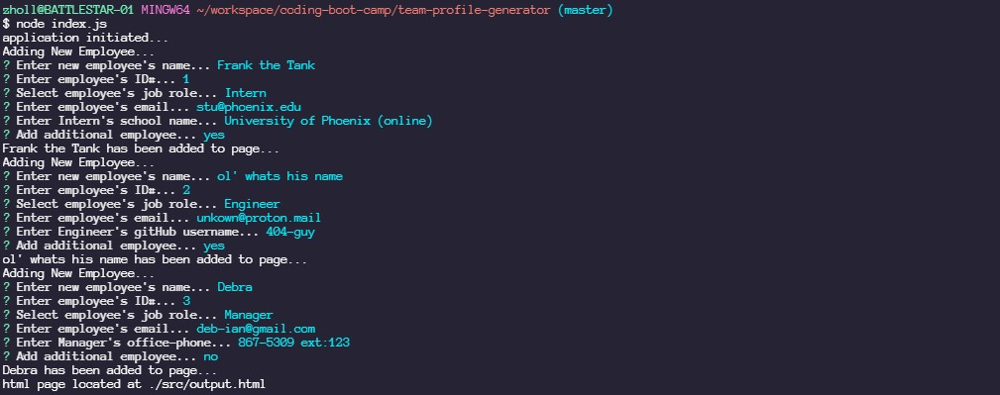

# team-profile-generator

## Table of Contents
* [Description](#description)
* [Installation&Testing](#installation&testing)
* [Usage-Instructions](#usage-instructions)
* [Contact](#contact)

## Description:

* Node.js CLI application that takes in information about employees and generates it on an html webpage. Application uses inquire to get employee information and job title as well as role specific data input. Roles include Engineer, Intern and Manager. 
** Engineer Role Info: GitHub user name
** Intern Role Info: Students school
** Manager Role Info: Office phone number
* Gif Link: https://drive.google.com/file/d/1kgNcA2cUj0mvQF9fnLJZZhpzxpmL9Fjd/view 

## Installation&Testing
* fork application repo
* run 'npm i' in root
* test with jest: run 'npm test'
** 

## Usage-Instructions
* Initialize application by running 'node index.js' in root.
* Follow prompts and input all employee data fields in CLI.
* Repeat process for every team member.
** 
* Upon completion find completed html page of team profile 
** 

## Contact
* email: 
* gitHub: Zach-EE