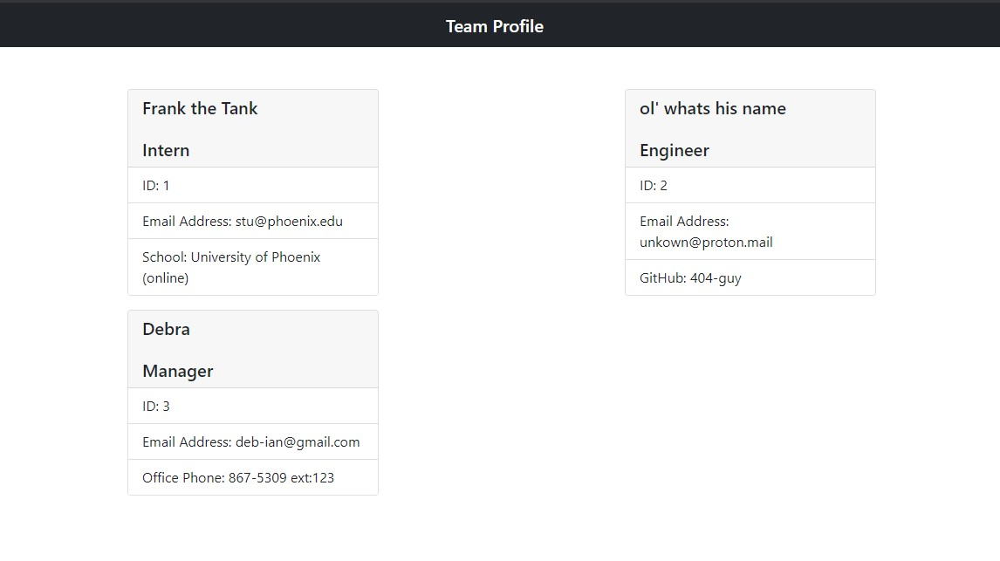

# team-profile-generator

## Table of Contents
* [Description](#description)
* [Installation & Testing](#installation)
* [Usage Instructions](#usage)
* [Contact](#contact)

## Description:

* Node.js CLI application that takes in information about employees and generates it on an html webpage. Application uses inquire to get employee information and job title as well as role specific data input. 

## Installation & Testing

## Usage Instructions

## Contact
